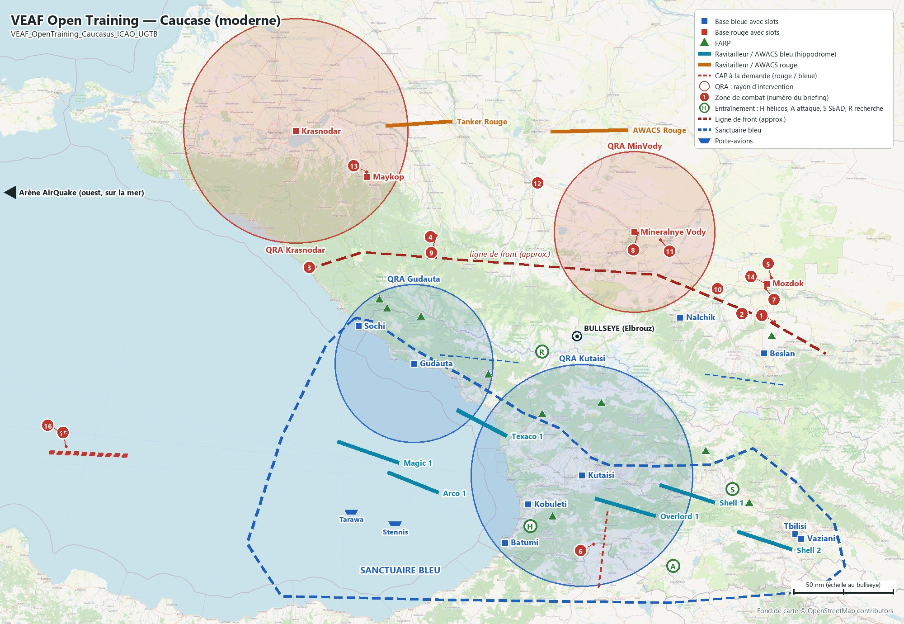
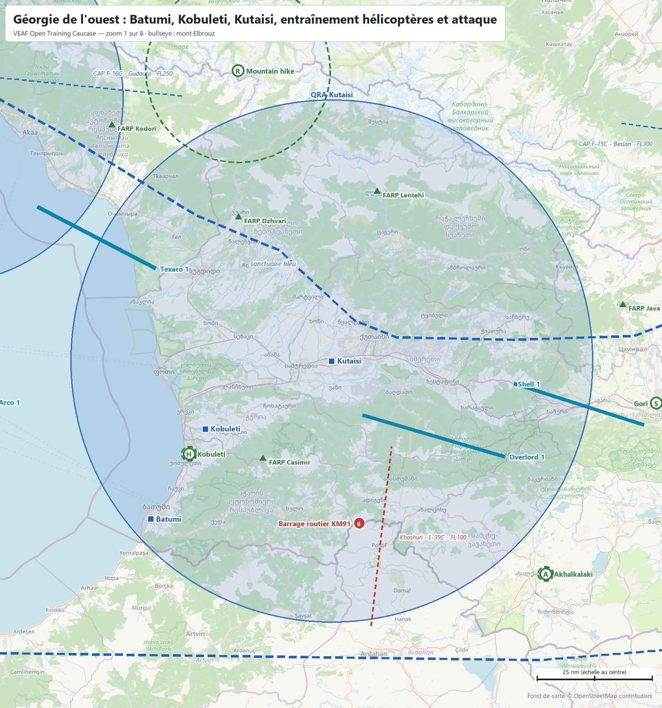
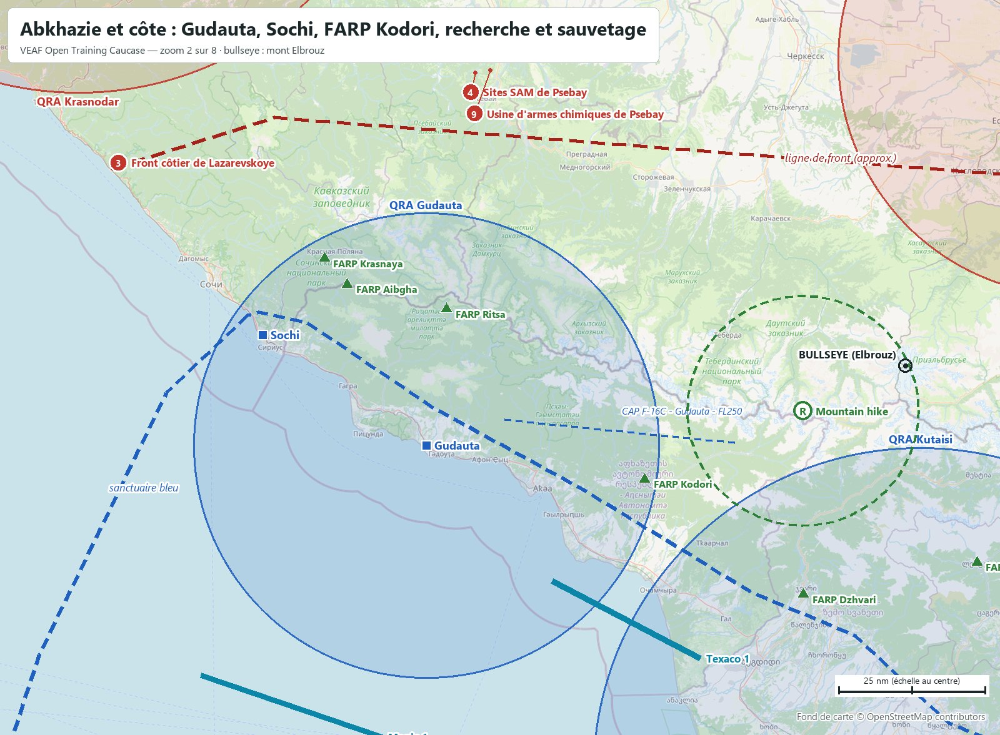
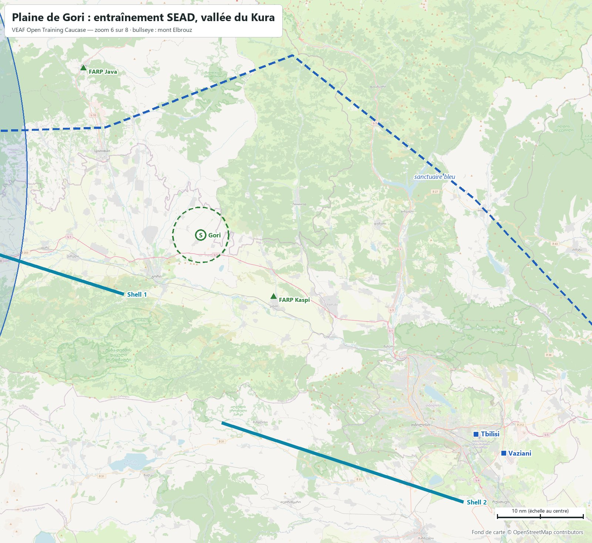
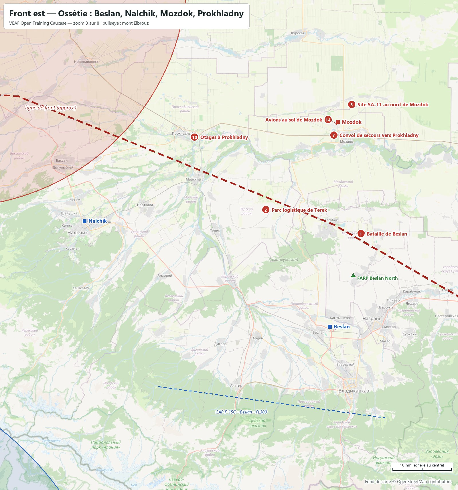
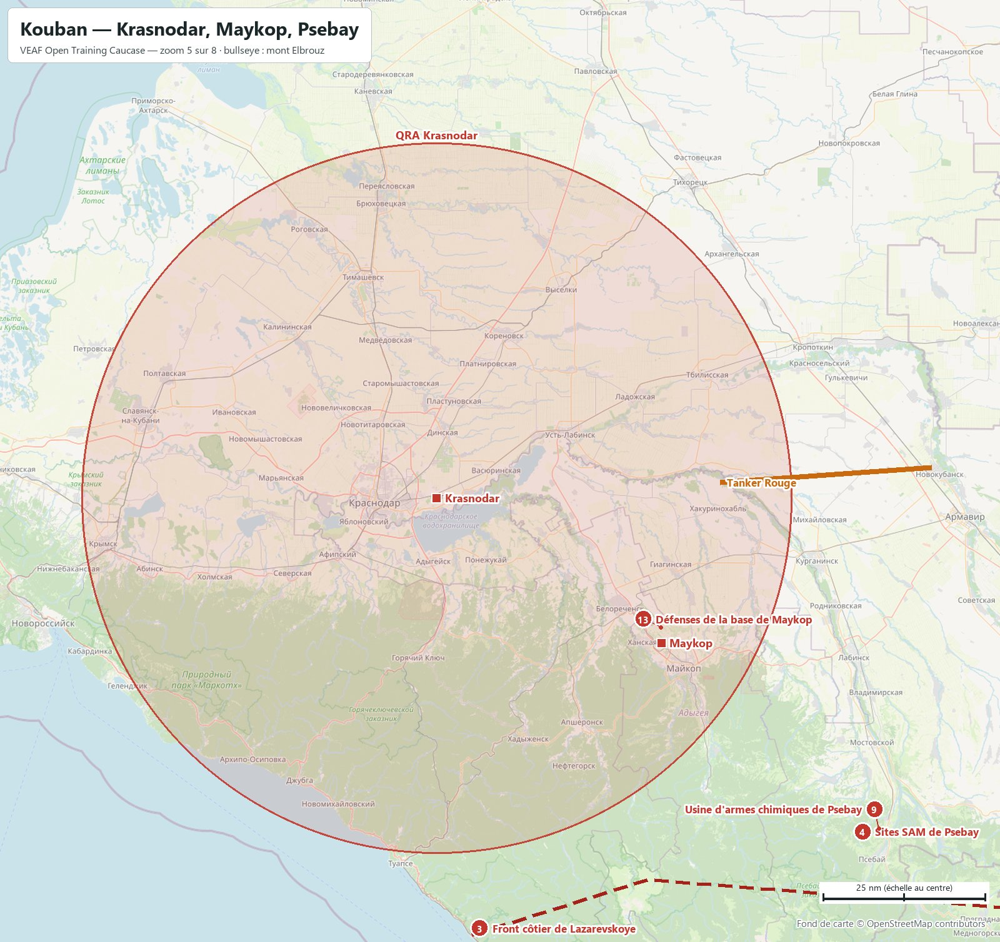
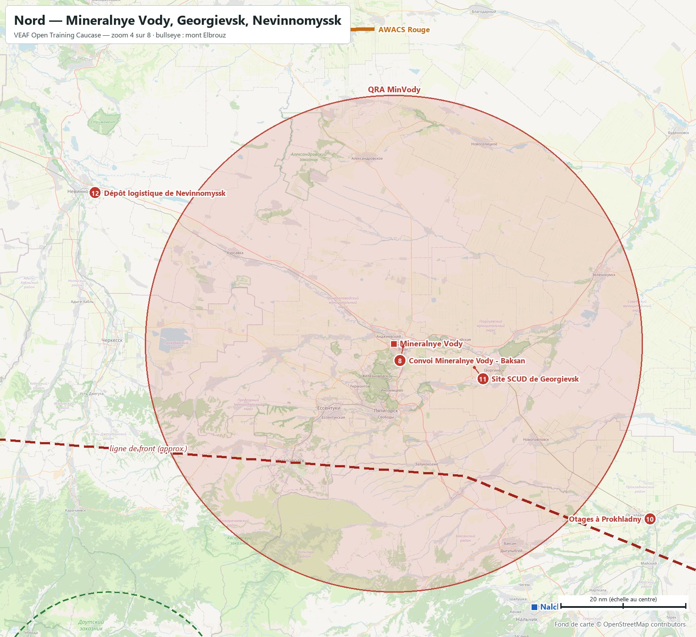
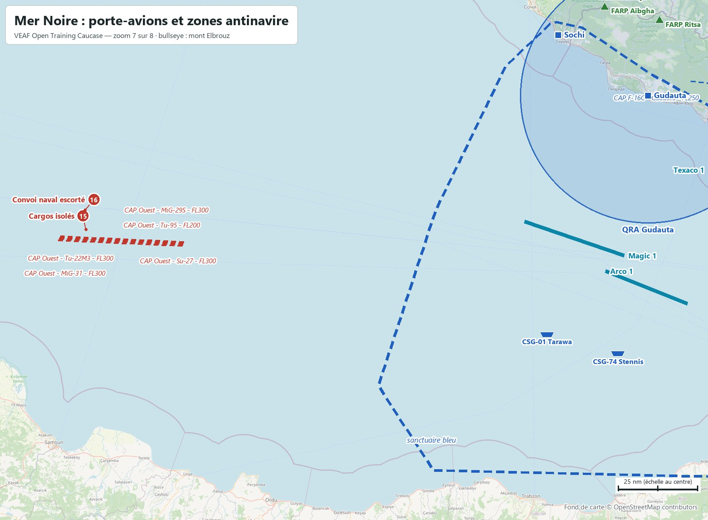
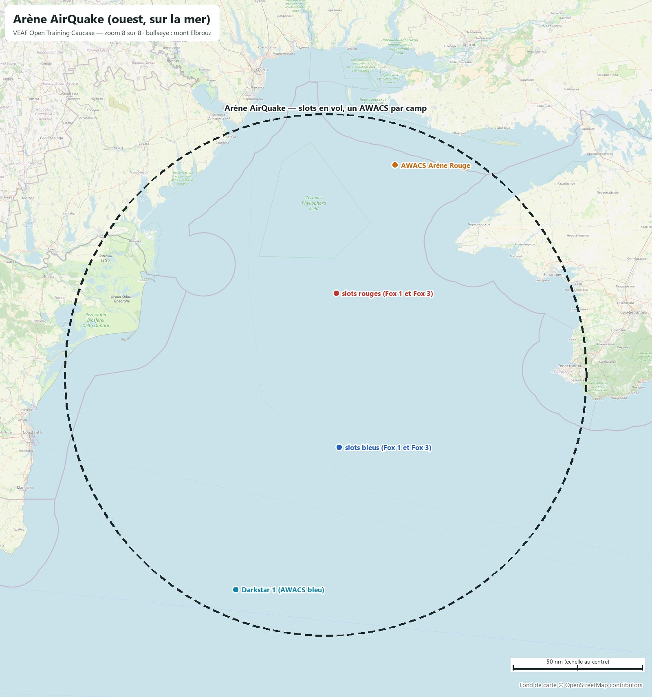

# VEAF Open Training — Caucase (moderne)

Mission d'entraînement ouverte des serveurs VEAF, sur la carte **Caucasus** de DCS, dans un scénario moderne fictif. Ce document est le briefing complet. Positions en degrés et minutes décimales, et en cap / distance depuis le bullseye (cap vrai, nautiques).

| Mission | Date | Bullseye (bleu et rouge) | Météo réelle | ATC |
|---|---|---|---|---|
| `VEAF_OpenTraining_Caucasus_ICAO_UGTB` | 29/06/2022 | mont Elbrouz · `N43°21.145' E042°26.271'` | UGTB (Tbilissi) | coupé sur tous les aérodromes |

Tout se pilote par le menu radio F10 : zones de combat, missions et CAP, soutien (*ASSETS*), porte-avions (*CARRIER OPS*).

**Sommaire** : [Carte](#carte) · [Situation](#situation) · [Bases](#bases) · [Défense aérienne permanente](#défense-aérienne-permanente) · [Soutien](#soutien) · [Entraînement](#entraînement) · [Zones de combat](#zones-de-combat) · [Missions scénarisées](#missions-scénarisées) · [QRA](#qra) · [CAP à la demande](#cap-à-la-demande) · [Combat entre joueurs](#combat-entre-joueurs) · [Plan radio](#plan-radio) · [Météo et heures](#météo-et-heures) · [Commandes utiles](#commandes-utiles) · [Pour les créateurs de mission](#pour-les-créateurs-de-mission)

## Carte



Carrés : bases avec slots. Traits pleins : hippodromes des ravitailleurs et AWACS ; tirets fins : CAP à la demande. Cercles : QRA. Pastilles vertes : entraînement (H hélicoptères, A attaque, S SEAD, R recherche). Pastilles rouges : zones de combat, numérotées comme la liste plus bas. Grands tirets bleus : sanctuaire. L'arène est hors du cadre, à l'ouest (flèche). La même image est dans le briefing DCS, et la carte F10 porte les mêmes dessins, chaque camp ne voyant que les siens. Générée par `tools/gen_map.py`.

Le panneau de briefing de DCS ajuste chaque image à sa taille : la carte du théâtre y sert de vue d'ensemble, et ce sont les zooms qui se lisent (flèches sous l'image). Ils sont repris ci-dessous dans les sections qu'ils illustrent : [Géorgie de l'ouest](docs/cartes/carte_01_georgie_ouest.jpg) · [Abkhazie et côte](docs/cartes/carte_02_abkhazie.jpg) · [Front est](docs/cartes/carte_03_front_est.jpg) · [Nord](docs/cartes/carte_04_nord_stavropol.jpg) · [Kouban](docs/cartes/carte_05_kouban.jpg) · [Plaine de Gori](docs/cartes/carte_06_gori.jpg) · [Mer Noire](docs/cartes/carte_07_mer_noire.jpg) · [Arène AirQuake (ouest, sur la mer)](docs/cartes/carte_08_arene.jpg).

## Situation

La Géorgie, soutenue par l'OTAN, tient une ligne avancée en Russie — Sochi, Nalchik, Beslan — face aux forces russes. Le front court de la mer Noire (Sochi / Maykop) à l'Ossétie du Nord (Beslan / Mozdok), sur environ 207 nm. Le secteur Ouest (péninsule de Taman et la mer au large) sert de terrain d'entraînement, hors QRA.

## Bases

<table><tr><td width="50%"><a href="docs/cartes/carte_01_georgie_ouest.jpg"></a><br><sub>Géorgie de l'ouest : Batumi, Kobuleti, Kutaisi, entraînement hélicoptères et attaque</sub></td><td width="50%"><a href="docs/cartes/carte_02_abkhazie.jpg"></a><br><sub>Abkhazie et côte : Gudauta, Sochi, FARP Kodori, recherche et sauvetage</sub></td></tr></table>

| Base | Camp | Slots | Position | Bullseye | UHF | VHF | Défense permanente |
|---|---|---|---|---|---|---|---|
| Batumi | bleu | oui | `N41°36.197' E041°36.557'` | BULLSEYE 193/112 | 270.3 | 130.3 | Avenger, NASAMS |
| Beslan | bleu | oui | `N43°12.510' E044°35.335'` | BULLSEYE 088/95 | 270.9 | 130.9 | Avenger, Hawk |
| Gudauta | bleu | oui | `N43°07.454' E040°33.851'` | BULLSEYE 255/84 | 270.2 | 130.2 | Avenger, NASAMS |
| Kobuleti | bleu | oui | `N41°55.926' E041°52.589'` | BULLSEYE 190/89 | 270.4 | 130.4 | Avenger, NASAMS |
| Kutaisi | bleu | oui | `N42°10.749' E042°29.741'` | BULLSEYE 171/71 | 270.5 | 130.5 | Avenger, NASAMS, Patriot |
| Nalchik | bleu | oui | `N43°30.604' E043°37.507'` | BULLSEYE 073/53 | 270.6 | 130.6 | Avenger, Hawk |
| Sochi-Adler | bleu | oui | `N43°26.363' E039°55.454'` | BULLSEYE 267/111 | 270.1 | 130.1 | Avenger, NASAMS, Patriot |
| Tbilisi-Lochini | bleu | oui | `N41°40.483' E044°56.812'` | BULLSEYE 125/151 | 270.7 | 130.7 | Avenger, NASAMS |
| Vaziani | bleu | oui | `N41°38.264' E045°01.145'` | BULLSEYE 125/155 | 270.8 | 130.8 | Avenger, NASAMS, Patriot |
| Senaki-Kolkhi | bleu | non | `N42°14.324' E042°03.661'` | BULLSEYE 188/69 | — | — | — |
| Soganlug | bleu | non | `N41°38.470' E044°56.831'` | BULLSEYE 125/153 | — | — | — |
| Sukhumi-Babushara | bleu | non | `N42°51.164' E041°08.547'` | BULLSEYE 236/65 | — | — | — |
| Krasnodar-Pashkovsky | rouge | oui | `N45°02.766' E039°12.184'` | BULLSEYE 301/173 | 275.2 | 131.2 | SA-19, SA-11, SA-10 |
| Maykop-Khanskaya | rouge | oui | `N44°40.286' E040°01.286'` | BULLSEYE 301/132 | 275.1 | 131.1 | SA-19, SA-11 |
| Mineralnye Vody | rouge | oui | `N44°13.119' E043°06.041'` | BULLSEYE 022/60 | 275.3 | 131.3 | SA-19, SA-11 |
| Mozdok | rouge | oui | `N43°47.478' E044°37.220'` | BULLSEYE 067/100 | 275.4 | 131.4 | SA-19, SA-11 |
| Anapa-Vityazevo | rouge | non | `N45°00.790' E037°21.587'` | BULLSEYE 290/242 | — | — | — |
| Gelendzhik | rouge | non | `N44°34.060' E038°00.249'` | BULLSEYE 286/206 | — | — | — |
| Krasnodar-Center | rouge | non | `N45°05.246' E038°55.512'` | BULLSEYE 299/185 | — | — | — |
| Krymsk | rouge | non | `N44°57.683' E037°59.153'` | BULLSEYE 292/216 | — | — | — |
| Novorossiysk | rouge | non | `N44°40.400' E037°47.174'` | BULLSEYE 287/217 | — | — | — |

FARP bleus (dépôt de munitions et chargement de troupes CTLD) :

- **FARP Kaspi** — `N41°56.573' E044°25.086'` — BULLSEYE 127/123
- **FARP Java** — `N42°23.073' E043°55.265'` — BULLSEYE 125/88
- **FARP Ritsa** — `N43°30.932' E040°38.627'` — BULLSEYE 271/79
- **FARP Lentehi** — `N42°47.555' E042°43.069'` — BULLSEYE 153/36
- **FARP Aibgha** — `N43°35.145' E040°15.301'` — BULLSEYE 273/97
- **FARP Beslan North** — `N43°21.297' E044°40.833'` — BULLSEYE 083/99
- **FARP Krasnaya** — `N43°39.543' E040°09.924'` — BULLSEYE 275/101
- **FARP Kodori** — `N43°01.843' E041°25.121'` — BULLSEYE 241/49
- **FARP Dzhvari** — `N42°42.026' E042°02.341'` — BULLSEYE 198/43
- **FARP Casimir** — `N41°49.547' E042°09.565'` — BULLSEYE 181/93

## Défense aérienne permanente

En plus de la défense de chaque base (tableau ci-dessus) : SA-10 à Krasnodar et à Stavropol, radars d'alerte (1L13 bleus, 55G6 rouges) derrière les lignes, en réseau Skynet. Aucune batterie permanente n'atteint une base adverse avec slots (portées de la table de menace DCS embarquée dans AIEN, vérifiées par `tools/check_portees.py`).

- EWR-SE (bleu) — `N41°52.699' E045°10.275'` — BULLSEYE 119/151
- EWR-SW (bleu) — `N41°39.470' E041°47.949'` — BULLSEYE 189/106
- EWR-NE (bleu) — `N43°17.735' E044°45.568'` — BULLSEYE 085/103
- EWR-NW (bleu) — `N43°31.771' E040°09.414'` — BULLSEYE 270/101
- Krasnodar-LR (rouge) — `N45°04.161' E039°16.296'` — BULLSEYE 302/172
- Stavropol-LR (rouge) — `N45°02.072' E041°58.436'` — BULLSEYE 342/104
- Stavropol-SR (rouge) — `N45°01.982' E041°59.565'` — BULLSEYE 343/103
- EWR-Rouge-NW (rouge) — `N45°06.108' E039°16.167'` — BULLSEYE 302/173
- EWR-Rouge-S (rouge) — `N44°01.098' E041°06.760'` — BULLSEYE 299/71
- EWR-Rouge-NE (rouge) — `N44°14.733' E043°05.743'` — BULLSEYE 021/61
- EWR-Rouge-E (rouge) — `N43°27.286' E045°01.096'` — BULLSEYE 079/114

## Soutien

| Indicatif | Rôle | Informations |
|---|---|---|
| Arco 1 | Arco 1 (KC-135, perche) - ouest | TACAN 51Y AR1 U251.0 - FL180 |
| Texaco 1 | Texaco 1 (KC-135MPRS, panier) - ouest | TACAN 52Y TX1 U252.0 - FL220 |
| Shell 1 | Shell 1 (KC-135MPRS, panier) - est | TACAN 53Y SH1 U253.0 - FL200 |
| Shell 2 | Shell 2 (KC-135, perche) - est | TACAN 54Y SH2 U254.0 - FL240 |
| Magic 1 | Magic 1 (E-3A) - ouest | U265.0 - FL300 |
| Overlord 1 | Overlord 1 (E-3A) - est | U266.0 - FL310 |
| CSG-74 Stennis | CVN-74 Stennis (porte-avions) - large de Batumi | TACAN 10X STS - ICLS 10 - Link 4 225.0 Tour 225.0 - S-3B et Pedro par le menu CARRIER OPS |
| CVN-74 Stennis S3B-Tanker | S-3B du Stennis (ravitailleur embarqué) | TACAN 75Y T74 U290.9 |
| CSG-01 Tarawa | LHA-1 Tarawa (porte-hélicoptères) - large de Batumi | TACAN 11X TAA - ICLS 11 Tour 226.0 |
| Tanker Rouge | Tanker Rouge (Il-78M) | U261.0 - FL200 |
| AWACS Rouge | AWACS Rouge (A-50) | U260.0 - FL300 |
| Darkstar 1 | Darkstar 1 (E-3A) - arène, bleu | U280.0 - FL300 |
| AWACS Arène Rouge | AWACS Arène Rouge (A-50) - arène, rouge | U281.0 - FL300 |
| Reaper 1 | Reaper 1 (drone laser) - Beslan | Laser 1688 - V118.8 AM FL150 au-dessus de la zone |
| Reaper 2 | Reaper 2 (drone laser) - Psebay | Laser 1687 - V118.9 AM FL150 au-dessus de la zone |

Les ravitailleurs et AWACS sont escortés. Les drones Reaper désignent au laser (menu *ASSETS*).

## Entraînement

Trois familles de trois niveaux (facile ⊂ moyen ⊂ difficile) : chaque niveau contient le précédent. Jouez un seul niveau à la fois.

[](docs/cartes/carte_06_gori.jpg)


### Entraînement hélicoptères

- **Kobuleti - hélicoptères - facile** — `N41°50.531' E041°47.878'` — Range de Kobuleti, 6 nm au sud-ouest de la base. Cibles inertes (statiques) : blindés, camions, missiles SCUD, bâtiments. Aucune défense. BULLSEYE 191/96. Ravitailleur le plus proche : Texaco 1 (TACAN 52Y, 252.0 MHz, FL220) à 51 nm.
- **Kobuleti - hélicoptères - moyen** — `N41°50.531' E041°47.878'` — Range de Kobuleti, cibles du niveau facile plus DCA légère : deux pièces tirées parmi quatre (ZU-23, Shilka). BULLSEYE 191/96. Ravitailleur le plus proche : Texaco 1 (TACAN 52Y, 252.0 MHz, FL220) à 51 nm.
- **Kobuleti - hélicoptères - difficile** — `N41°50.531' E041°47.878'` — Range de Kobuleti, niveau moyen plus une défense courte portée à guidage infrarouge : trois systèmes tirés parmi SA-13, SA-9 et MANPADS. BULLSEYE 191/96. Ravitailleur le plus proche : Texaco 1 (TACAN 52Y, 252.0 MHz, FL220) à 51 nm.

### Entraînement attaque

- **Akhalkalaki - attaque - facile** — `N41°24.141' E043°32.654'` — Plateau d'Akhalkalaki, sud de la Géorgie. Colonne blindée à l'arrêt, cibles inertes (statiques). Aucune défense. BULLSEYE 150/128. Ravitailleur le plus proche : Shell 1 (TACAN 53Y, 253.0 MHz, FL200) à 38 nm.
- **Akhalkalaki - attaque - moyen** — `N41°24.141' E043°32.654'` — Plateau d'Akhalkalaki, cibles du niveau facile plus deux compagnies blindées vivantes et une DCA légère (deux pièces tirées parmi quatre). BULLSEYE 150/128. Ravitailleur le plus proche : Shell 1 (TACAN 53Y, 253.0 MHz, FL200) à 38 nm.
- **Akhalkalaki - attaque - difficile** — `N41°24.141' E043°32.654'` — Plateau d'Akhalkalaki, niveau moyen plus un bataillon blindé et une défense courte portée réaliste : deux systèmes tirés parmi SA-8, SA-15, SA-13 et SA-19, plus des MANPADS. BULLSEYE 150/128. Ravitailleur le plus proche : Shell 1 (TACAN 53Y, 253.0 MHz, FL200) à 38 nm.

### Entraînement SEAD

- **Gori - SEAD - facile** — `N42°03.734' E044°13.650'` — Plaine de Gori, vallée du Kura. Une batterie SA-6 seule, sans radar d'alerte. BULLSEYE 127/112. Ravitailleur le plus proche : Shell 1 (TACAN 53Y, 253.0 MHz, FL200) à 24 nm.
- **Gori - SEAD - moyen** — `N42°03.734' E044°13.650'` — Plaine de Gori, le SA-6 du niveau facile protégé par une défense courte portée (SA-15, SA-8, Shilka). BULLSEYE 127/112. Ravitailleur le plus proche : Shell 1 (TACAN 53Y, 253.0 MHz, FL200) à 24 nm.
- **Gori - SEAD - difficile** — `N42°03.734' E044°13.650'` — Plaine de Gori, réseau intégré sous Skynet : SA-11, le SA-6 et la courte portée des niveaux inférieurs, et un radar d'alerte 55G6. Pas de SA-10 ici : une zone d'entraînement ne doit couvrir ni une base amie ni une autre zone, et la carte en a ailleurs. BULLSEYE 127/112. Ravitailleur le plus proche : Shell 1 (TACAN 53Y, 253.0 MHz, FL200) à 24 nm.

### Entraînement recherche

- **Mountain hike - équipage abattu** — `N43°13.448' E042°02.223'` — Un Mi-8 ami s'est écrasé en montagne, 45 nm au nord-est de Soukhoumi, près de la frontière russe. Décollez du FARP Kodori, suivez la vallée vers le nord-est et localisez l'épave. Balises FM sur l'itinéraire : MH01 31.0, MH02 32.0, MH03 33.0 ; l'équipage émet un SOS sur 34.0 FM. BULLSEYE 250/21.

## Zones de combat

Menus F10 par type. Les défenses citées sont celles de la zone ; certaines sont tirées au hasard à chaque activation.

<table><tr><td width="50%"><a href="docs/cartes/carte_03_front_est.jpg"></a><br><sub>Front est — Ossétie : Beslan, Nalchik, Mozdok, Prokhladny</sub></td><td width="50%"><a href="docs/cartes/carte_05_kouban.jpg"></a><br><sub>Kouban — Krasnodar, Maykop, Psebay</sub></td></tr><tr><td width="50%"><a href="docs/cartes/carte_04_nord_stavropol.jpg"></a><br><sub>Nord — Mineralnye Vody, Georgievsk, Nevinnomyssk</sub></td><td width="50%"><a href="docs/cartes/carte_07_mer_noire.jpg"></a><br><sub>Mer Noire : porte-avions et zones antinavire</sub></td></tr></table>


### Front

- **1. Bataille de Beslan** — `N43°28.468' E044°42.680'` — Bataille blindée au nord de Beslan : trois compagnies de BTR-80 rouges montent à l'assaut des Abrams bleus, deux groupes blindés en renfort. Détruisez les blindés rouges ; ne tirez pas sur les Abrams. Défense : SA-8 (un des deux sites), MANPADS, Shilka. Drone Reaper 1 au-dessus (laser 1688). BULLSEYE 078/101. Ravitailleur le plus proche : Shell 1 (TACAN 53Y, 253.0 MHz, FL200) à 99 nm.
- **2. Parc logistique de Terek** — `N43°32.535' E044°20.220'` — Le parc logistique de Terek ravitaille l'offensive rouge sur Beslan. Détruisez les camions. Défense légère : DCA de convoi, une chance sur deux d'infanterie mécanisée, MANPADS. BULLSEYE 075/84. Ravitailleur le plus proche : Shell 1 (TACAN 53Y, 253.0 MHz, FL200) à 96 nm.
- **3. Front côtier de Lazarevskoye** — `N43°55.669' E039°21.602'` — Le front de la côte, au nord-ouest de Sochi : deux groupes blindés et une batterie de lance-roquettes BM-21 en appui. Détruisez les blindés et les BM-21. Défense : SA-13, Shilka. BULLSEYE 279/139. Ravitailleur le plus proche : Texaco 1 (TACAN 52Y, 252.0 MHz, FL220) à 117 nm.

### SEAD

- **4. Sites SAM de Psebay** — `N44°10.865' E040°45.306'` — Les sites SAM qui couvrent l'usine de Psebay : un SA-2, un SA-6, et un SA-15 (un des deux sites), plus de la DCA. Neutralisez les radars avant la frappe de l'usine. BULLSEYE 298/89. Ravitailleur le plus proche : Texaco 1 (TACAN 52Y, 252.0 MHz, FL220) à 97 nm.
- **5. Site SA-11 au nord de Mozdok** — `N43°50.484' E044°40.468'` — Une batterie SA-11 isolée au nord de Mozdok, protégée par un SA-15 et de la DCA. Détruisez le radar et les lanceurs du SA-11. BULLSEYE 066/103. Ravitailleur le plus proche : Shell 1 (TACAN 53Y, 253.0 MHz, FL200) à 118 nm.

### Convois

- **6. Barrage routier KM91** — `N41°35.288' E042°37.849'` — Les Russes tiennent un barrage sur la route Batumi - Tbilissi, et un convoi arrive de l'est pour le renforcer. Détruisez les bunkers, les blindés du poste et le convoi. Défense : la Shilka du convoi, MANPADS. BULLSEYE 169/107. Ravitailleur le plus proche : Shell 1 (TACAN 53Y, 253.0 MHz, FL200) à 55 nm.
- **7. Convoi de secours vers Prokhladny** — `N43°45.274' E044°36.248'` — Un convoi blindé part de Mozdok pour secourir la garnison de Prokhladny, par la route. Arrêtez-le avant qu'il arrive. Défense dans la colonne : Shilka et SA-13. BULLSEYE 068/98. Ravitailleur le plus proche : Shell 1 (TACAN 53Y, 253.0 MHz, FL200) à 112 nm.
- **8. Convoi Mineralnye Vody - Baksan** — `N44°12.644' E043°08.098'` — Un convoi de ravitaillement quitte Mineralnye Vody par la route vers Baksan, derrière le front de Nalchik. Détruisez les camions. Défense : BMP-2 et Shilka dans la colonne. BULLSEYE 024/60. Ravitailleur le plus proche : Texaco 1 (TACAN 52Y, 252.0 MHz, FL220) à 124 nm.

### Frappe

- **9. Usine d'armes chimiques de Psebay** — `N44°11.313' E040°48.832'` — Cette usine fabrique des armes chimiques pour un groupe terroriste. Détruisez les deux bâtiments de l'usine et le bunker des scientifiques ; le reste est secondaire. Défense : DCA, une chance sur deux d'un SA-15, et les sites SAM voisins (zone « Sites SAM de Psebay »). BULLSEYE 299/87. Ravitailleur le plus proche : Texaco 1 (TACAN 52Y, 252.0 MHz, FL220) à 97 nm.
- **10. Otages à Prokhladny** — `N43°44.915' E044°03.411'` — Des otages sont retenus dans un hôtel fortifié de Prokhladny. Détruisez la caserne et les patrouilles de BTR-80 ; l'hôtel doit rester debout pour l'équipe au sol. Défense : Shilka, SA-9, une chance sur deux d'un SA-8, MANPADS. BULLSEYE 064/75. Ravitailleur le plus proche : Shell 1 (TACAN 53Y, 253.0 MHz, FL200) à 106 nm.
- **11. Site SCUD de Georgievsk** — `N44°09.283' E043°24.024'` — Quatre lanceurs SCUD en position de tir à l'ouest de Georgievsk. Détruisez les lanceurs. Défense : SA-15, Shilka, MANPADS. BULLSEYE 034/64. Ravitailleur le plus proche : Texaco 1 (TACAN 52Y, 252.0 MHz, FL220) à 129 nm.
- **12. Dépôt logistique de Nevinnomyssk** — `N44°37.297' E041°59.097'` — Le grand dépôt de carburant et de munitions qui alimente le front. Détruisez les réservoirs et les entrepôts. Défense locale : SA-19 et DCA ; attention, le dépôt est sous la couverture permanente du SA-10 de Stavropol. BULLSEYE 339/79. Ravitailleur le plus proche : Texaco 1 (TACAN 52Y, 252.0 MHz, FL220) à 124 nm.

### OCA

- **13. Défenses de la base de Maykop** — `N44°42.707' E040°01.249'` — La base de Maykop est défendue par un bataillon SA-10, deux SA-15 tirés parmi quatre sites, quatre pièces de DCA tirées parmi huit, et des blindés. Neutralisez les défenses pour préparer l'assaut. BULLSEYE 302/133. Ravitailleur le plus proche : Texaco 1 (TACAN 52Y, 252.0 MHz, FL220) à 138 nm.
- **14. Avions au sol de Mozdok** — `N43°47.215' E044°36.861'` — Des bombardiers Tu-22M3, des Su-24M, des Su-25 et un Il-76 sont stationnés sur la base de Mozdok. Détruisez-les au sol. Défense de zone : SA-15, Shilka ; défense permanente de la base : SA-11 et SA-19. BULLSEYE 067/99. Ravitailleur le plus proche : Shell 1 (TACAN 53Y, 253.0 MHz, FL200) à 114 nm.

### Antinavire

- **15. Cargos isolés** — `N42°25.387' E036°33.648'` — Des cargos sans escorte ravitaillent l'ennemi par la mer. Coulez-les. BULLSEYE 253/266. Ravitailleur le plus proche : Arco 1 (TACAN 51Y, 251.0 MHz, FL180) à 179 nm.
- **16. Convoi naval escorté** — `N42°31.489' E036°33.154'` — Des cargos escortés par des bâtiments de guerre ; une frégate Neustrashimy peut les accompagner. Coulez les cargos. BULLSEYE 255/265. Ravitailleur le plus proche : Arco 1 (TACAN 51Y, 251.0 MHz, FL180) à 180 nm.

## Missions scénarisées

Menu F10 *MISSIONS* : attaque rouge sur Gudauta (défendre la base), vague de 11 Tu-160 à abattre en 15 minutes (secteur Ouest), interception d'un transport VIP escorté entre Krasnodar et Mineralnye Vody.

## QRA

| QRA | Camp | Base | Rayon | Réponse |
|---|---|---|---|---|
| QRA MinVody | red | Mineralnye Vody | 40 nm | ≥ 1 intrus : 1 groupe(s) parmi Su-27, Su-30 ; ≥ 3 intrus : 2 groupe(s) parmi Su-27, Su-30, MiG-31 |
| QRA Krasnodar | red | Krasnodar-Pashkovsky | 55 nm | ≥ 1 intrus : 1 groupe(s) parmi MiG-29S, Su-27 ; ≥ 3 intrus : 2 groupe(s) parmi MiG-29S, Su-27, MiG-31 |
| QRA Kutaisi | blue | Kutaisi | 57 nm | ≥ 1 intrus : 1 groupe(s) parmi F-16C, F-15C ; ≥ 3 intrus : 2 groupe(s) parmi F-16C, F-15C |
| QRA Gudauta | blue | Gudauta | 40 nm | ≥ 1 intrus : 1 groupe(s) parmi F-16C, F-15C ; ≥ 3 intrus : 2 groupe(s) parmi F-16C, F-15C |

Décollage une minute après l'entrée du premier intrus ; les QRA ne réagissent pas aux hélicoptères.

## CAP à la demande

- **CAP Ouest - Tu-22M3 - FL300** — Deux Tu-22M3 : bombardier à intercepter. Hippodrome au FL300 centré sur BULLSEYE 252/256.
- **CAP Ouest - Tu-95 - FL200** — Deux Tu-95 : bombardier lent à intercepter. Hippodrome au FL200 centré sur BULLSEYE 252/256.
- **CAP Ouest - Su-27 - FL300** — Paire de Su-27 armés Fox 1 (guidage radar semi-actif). Hippodrome au FL300 centré sur BULLSEYE 252/256.
- **CAP Ouest - MiG-29S - FL300** — Paire de MiG-29S armés Fox 3. Hippodrome au FL300 centré sur BULLSEYE 252/256.
- **CAP Ouest - MiG-31 - FL300** — Paire de MiG-31 : intercepteur haut et rapide, Fox 3 longue portée. Hippodrome au FL300 centré sur BULLSEYE 252/255.
- **Khashuri - L-39C - FL100** — Paire de L-39C lents cap au nord, vers Khashuri : cible d'interception facile. Hippodrome au FL100 centré sur BULLSEYE 166/110.
- **CAP F-16C - Gudauta - FL250** — Paire de F-16C armés Fox 3 : opposition pour les joueurs rouges. Hippodrome au FL250 centré sur BULLSEYE 251/51.
- **CAP F-15C - Beslan - FL300** — Paire de F-15C armés Fox 3 : opposition pour les joueurs rouges. Hippodrome au FL300 centré sur BULLSEYE 097/88.

## Combat entre joueurs

[](docs/cartes/carte_08_arene.jpg)

- **Arène AirQuake**, loin à l'ouest sur la mer : slots en vol pour les deux camps, par type de missile (Fox 1, Fox 3), un AWACS par camp (Darkstar 1 et AWACS Arène Rouge).
- Entre les bases avec slots des deux camps.
- **Sanctuaire bleu** : le sud de la Géorgie. Un avion rouge qui y entre est détruit au bout de 60 secondes, et les missiles tirés sur un avion bleu à l'intérieur sont détruits.

## Plan radio

| Canal | UHF | VHF |
|---|---|---|
| Guard | 243 | 121.5 |
| Magic 1 (AWACS) | 265.0 | — |
| Overlord 1 (AWACS) | 266.0 | — |
| Arco 1 / perche / 51Y | 251.0 | — |
| Texaco 1 / panier / 52Y | 252.0 | — |
| Shell 1 / panier / 53Y | 253.0 | — |
| Shell 2 / perche / 54Y | 254.0 | — |
| CVN-74 Stennis / 10X | 225.0 | — |
| LHA-1 Tarawa / 11X | 226.0 | — |
| Darkstar 1 (AWACS arene) | 280.0 | — |
| AWACS Rouge (A-50) | 260.0 | — |
| Tanker Rouge (Il-78M) | 261.0 | — |
| AWACS Arene Rouge (A-50) | 281.0 | — |
| Reaper 1 (drone laser 1688) | — | 118.8 |
| Reaper 2 (drone laser 1687) | — | 118.9 |
| Sochi | 270.1 | 130.1 |
| Gudauta | 270.2 | 130.2 |
| Batumi | 270.3 | 130.3 |
| Kobuleti | 270.4 | 130.4 |
| Kutaisi | 270.5 | 130.5 |
| Nalchik | 270.6 | 130.6 |
| Tbilisi | 270.7 | 130.7 |
| Vaziani | 270.8 | 130.8 |
| Beslan | 270.9 | 130.9 |
| Maykop | 275.1 | 131.1 |
| Krasnodar | 275.2 | 131.2 |
| MinVody | 275.3 | 131.3 |
| Mozdok | 275.4 | 131.4 |
| Archer | 360.0 | 120.0 |
| Arctic | 360.1 | 120.1 |
| Ninja | 360.2 | 120.2 |
| Pinder | 360.3 | 120.3 |
| Bengal | 360.4 | 120.4 |
| Blade | 360.5 | 120.5 |
| Rouge-1 | 380.0 | 124.0 |
| Rouge-2 | 380.1 | 124.1 |
| Rouge-3 | 380.2 | 124.2 |
| Rouge-4 | 380.3 | 124.3 |

FM 30 à 59 en supplément (hélicoptères, A-10C) ; balises du Mountain hike sur 31.0 à 34.0 FM.

## Météo et heures

20 variantes : nuit, aube, matin, jour, soir × réel (METAR de Tbilissi), dégagé, épars, pluie. Fuseau Asia/Tbilisi, date 2022-06-29.

## Commandes utiles

Un marqueur sur la carte F10, avec une commande dans son texte : `-sa6`, `-armor`, `-convoy, dest <point>`, `-jtac, laser 1688`, `-point <nom>`. Options : `side`, `size`, `defense 0-5`, `armor 0-5`, `dest`, `patrol`.

## Pour les créateurs de mission

Construite de zéro le 28/09/2026 avec VEAF Mission Creation Tools (`veaf-tools`, 6.26.0) et le serveur MCP `veaf-mission-mcp`, à partir du prompt `new-open-training-mission.fr.md` de VMCT, en s'inspirant de la v5 (`VEAF-Open-Training-Mission-Caucasus`, dossier `backup_v5/`) sans la recopier. Trois ensembles en sont repris : l'arène « Air Quake », le groupe aéronaval du Stennis et la zone hélicoptère « Mountain Hike ».

### Construire

```powershell
# récupérer les outils et les scripts VEAF (exécutables et published/, hors dépôt)
.\veaf-tools-updater.exe

# contrôle avant build
.\veaf-tools.exe mission validate

# configuration serveur : sécurité active, logs info, 20 variantes météo dans missions/
.\veaf-tools.exe mission build

# essais sur un poste : sécurité coupée, logs debug, noms de groupes lisibles, pas de variantes
.\veaf-tools.exe mission build --profile LOCAL_TEST
```

### Fichiers

| Fichier | Rôle |
|---|---|
| `mission.yaml` | Identité, sécurité, profil `LOCAL_TEST`, modules, zones de combat (niveaux imbriqués par `includes:`), QRA, CAP, assets |
| `ctld-config.yaml` | Points logistiques, troupes et cargos CTLD |
| `src/mission/` | La mission DCS éclatée (groupes, zones de déclenchement, aérodromes, dessins de la carte F10) |
| `src/presets.yaml` | Plan radio bleu et rouge |
| `src/versions.yaml` | Variantes météo et heure |
| `src/waypoints.yaml` | Points de navigation injectés dans les appareils joueurs |
| `src/warehouses.yaml` | Bases qui offrent des slots, carburant et munitions illimités, appareils proposés sur le pont du porte-avions (`ships:`) |
| `src/spawnables.yaml`, `src/spawn-groups.yaml` | Groupes tirables par les zones de combat et les QRA |
| `src/dynamic-slot-templates.yaml` | Appareils proposés en slots dynamiques |
| `src/scripts/*.lua` | Configuration des scripts VEAF embarqués (`veaf-config.lua`, CTLD, script de mission) |
| `src/mission/l10n/DEFAULT/*.ogg` | Sons des balises de la zone de sauvetage (MH01 à MH03, SOS), déclarés dans `mapResource` |
| `docs/carte.jpg`, `docs/cartes/` | La carte du théâtre et les huit zooms ; les mêmes images sont dans `src/mission/l10n/DEFAULT/` pour le briefing DCS, où `tools/gen_map.py` écrit lui-même `mapResource` et les listes `pictureFileName*` (côté bleu et neutre seulement : DCS affiche la liste rouge puis la bleue à un joueur dont il ignore le camp, et une image présente dans les deux s’afficherait deux fois) |
| `tools/paths.py` | Où trouver le code Python de VMCT ; se règle par la variable d’environnement `VMCT_PY` |
| `tools/` | Les générateurs qui ont construit la mission (`gen_*.py`), les lots rejouables (`tools/batches/`), les contrôles (`check_portees.py`, `verify.py`) et `retours-vmct.md` (ce que les outils n'ont pas su faire) |

Hors dépôt (voir `.gitignore`) : les exécutables téléchargés (`veaf-tools`, `dcs-serve`, `dcs-client`), les scripts VEAF de `published/`, les `.miz` construits et `missions/`, les sauvegardes `.veaf-backups/`.

### Régénérer ce document

Ce README est **généré depuis la mission** : aucune valeur n'y est tapée à la main. Après tout changement dans `src/` ou `mission.yaml` :

```powershell
python tools\gen_map.py     # la carte du théâtre, les zooms, et les images du briefing DCS
python tools\gen_readme.py  # ce fichier
```

### Limites connues

Plusieurs éléments n'ont pas d'action MCP dédiée et ont été écrits par script directement dans la table de la mission : leurres et indicatifs des slots de l'arène, tâches ATC et slots de pont du porte-avions, entrepôt du navire, balises radio de la zone de sauvetage, balises de tirage (`#spawngroup`, `#spawncount`) des zones de combat. Ils se relisent dans `src/mission/mission` comme le reste. Le détail est dans `tools/retours-vmct.md`.
